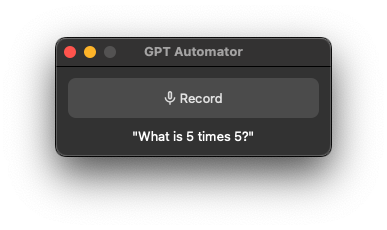

# GPT 自动化工具



您的语音控制Mac助手。GPT自动化工具让您可以使用语音在Mac上执行任务。例如，打开应用程序、查找餐厅和综合信息。

由[Luke Harries](https://harries.co/)和[Chidi Williams](https://chidiwilliams.com/)在[2023年2月伦敦EA黑客马拉松](https://forum.effectivealtruism.org/events/gTSwA8RoGidjpLnf6/london-ea-hackathon)上制作。

[](https://www.loom.com/share/7bfa82c604f3412fbbb04191ce2ae12f "GPT自动化工具演示")

## 要求

* [FFmpeg](https://ffmpeg.org/)

   ```shell
   # 在Ubuntu或Debian上
   sudo apt update && sudo apt install ffmpeg

   # 在Arch Linux上
   sudo pacman -S ffmpeg

   # 在MacOS上使用Homebrew (https://brew.sh/)
   brew install ffmpeg

   # 在Windows上使用Chocolatey (https://chocolatey.org/)
   choco install ffmpeg

   # 在Windows上使用Scoop (https://scoop.sh/)
   scoop install ffmpeg
   ```

## 使用说明

1. 从`requirements.txt`或`pyproject.toml`文件安装依赖项。
2. 从`.env.example`文件创建一个`.env`文件，并填写OpenAI API密钥。
3. 运行`python gui.py`来启动GUI，然后点击"录音"说出您的提示。或者，运行`python main.py [提示]`来使用命令行界面。

## 工作原理

GPT自动化工具使用OpenAI的Whisper将您的音频输入转换为文本。然后，它使用[LangChain](https://github.com/hwchase17/langchain)代理来选择一组操作，包括使用OpenAI的GPT-3（"text-davinci-003"）从您的提示生成AppleScript（用于桌面自动化）和JavaScript（用于浏览器自动化）命令，然后执行生成的脚本。

## 示例提示

* 查找计算结果。提示："2加2等于多少？" -> 它将编写AppleScript来打开计算器并输入5 * 5。
* 查找附近的餐厅。提示："找到我附近的餐厅" -> 它将打开Google搜索，阅读页面上的文本，并说出最好的餐厅。
* 下一盘国际象棋。提示："下一盘国际象棋" -> 它将打开Chess.com并开始点击。

## 了解更多

查看我们的博客文章以获取更多信息：
- [Chidi的博客文章](https://chidiwilliams.com/post/gpt-automator/)
- [Luke的博客文章](https://harries.co/ea-hackathon-gpt-automator-and-langchain/)

## 免责声明

本项目执行从自然语言生成的代码，可能容易受到[提示注入](https://en.wikipedia.org/wiki/Prompt_engineering#Prompt_injection)和类似攻击。这项工作是作为概念验证而制作的，不适合生产使用。
