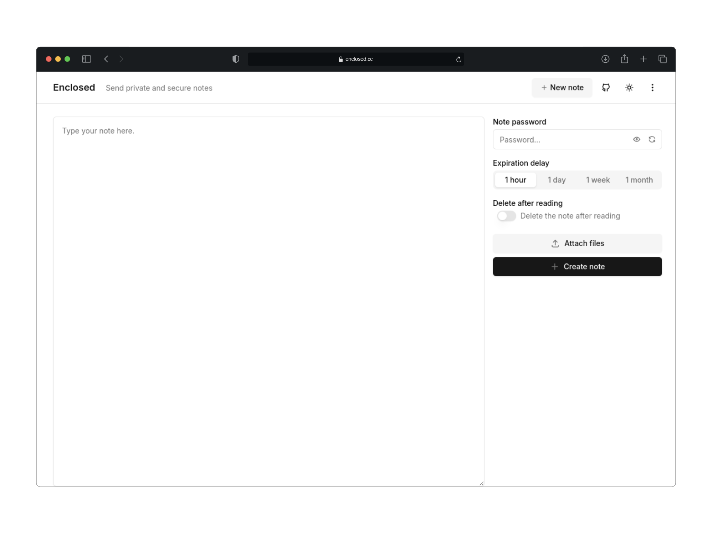

<picture>
    <source srcset="./.github/icon-dark.png" media="(prefers-color-scheme: light)">
    <source srcset="./.github/icon-light.png" media="(prefers-color-scheme: dark)">
    
</picture>

<h1 align="center">
  Enclosed - 发送私密且安全的笔记
</h1>

  为发送端到端加密的笔记和文件而设计的简约网络应用程序。

  <a href="https://enclosed.cc">演示</a>
  &nbsp;&nbsp;•&nbsp;&nbsp;
  <a href="https://docs.enclosed.cc">文档</a>
  &nbsp;&nbsp;•&nbsp;&nbsp;
  <a href="https://www.npmjs.com/package/@enclosed/cli">CLI</a>
  &nbsp;&nbsp;•&nbsp;&nbsp;
  <a href="https://docs.enclosed.cc/self-hosting/docker">自托管</a>

## 介绍

**Enclosed** 是一个为发送私密且安全的笔记而设计的简约网络应用程序。

所有笔记都进行端到端加密，确保服务器和存储对内容一无所知。用户可以设置密码，定义过期时间（TTL），并选择在阅读后自毁笔记。

一个现场实例可在 [enclosed.cc](https://enclosed.cc) 访问。

## 特点

- **端到端加密**：您的笔记在客户端进行加密，使用 AES-GCM 与通过 PBKDF2 派生的 256 位密钥。
- **文件附件**：与您的笔记安全共享文件。
- **零知识**：服务器无法访问笔记或文件的内容。
- **可配置的安全选项**：设置密码，过期时间，并选择阅读后自毁。
- **简约 UI**：简单直观的用户界面，便于快速分享笔记。
- **i18n 支持**：支持多种语言。
- **认证**：可选的电子邮件/密码认证来创建笔记。
- **暗黑模式**：适合夜间分享笔记的暗色主题。
- **响应式设计**：适用于从桌面到手机的所有设备。
- **开源**：源代码在 Apache 2.0 许可下可用。
- **可自托管**：运行您的 Enclosed 实例进行私密笔记分享。
- **CLI**：一个用于从终端创建笔记的命令行界面。
- **非常低的环境影响**：[enclosed.cc 在 websitecarbon.com 上的评级为 A+](https://www.websitecarbon.com/website/enclosed-cc/)。

## 自托管

### 使用 Docker 试用

您可以使用 Docker 快速运行应用程序。
